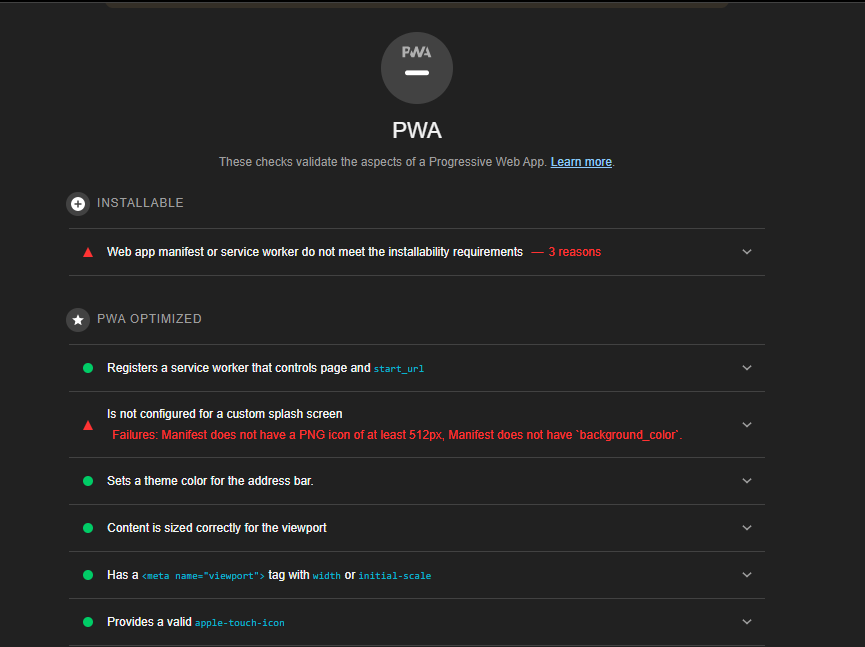
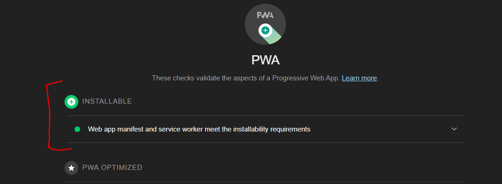

# CodeLab

## Part 1: PWA

1. Run your application ( npm start )
2. Open ***localhost:3000*** and then go to the ***Lighthouse*** Tab
3. leave the configuration as the next image shows:
   
5. Click on ***Generate report*** and wait for the browser to create the report.
   
7. Let's create a new ***Service Worker*** to address the install issue
8. Create a file called ***worker.js*** inside the ***public*** folder of your project
9. Add the following code ( Don't pay much atention to it for now, this code will install and update whenever is required a Service Worker for your application to cache resources, for it to have a similar behaviour as native apps ):
	```js
	/* eslint-disable no-restricted-globals */

	var  CACHE_NAME = 'pwa-task-planner';
	// Update this array to your defined routes
	var  urlsToCache = [
		'/',
	];
	
	// Install a service worker
	self.addEventListener('install', event  => {
	// Perform install steps
		event.waitUntil(
			caches.open(CACHE_NAME)
			.then(function(cache) {
				console.log('Opened cache');
				return  cache.addAll(urlsToCache);
			})
		);
	});  

	// Cache and return requests
	self.addEventListener('fetch', event  => {
		event.respondWith(
			caches.match(event.request)
			.then(function(response) {
				// Cache hit - return response
				if (response) {
					return  response;
				}
				return  fetch(event.request);
				}
			)
		);
	});  

	// Update a service worker
	self.addEventListener('activate', event  => {
		var  cacheWhitelist = ['pwa-task-planner'];
		event.waitUntil(
			caches.keys().then(cacheNames  => {
				return  Promise.all(
					cacheNames.map(cacheName  => {
						if (cacheWhitelist.indexOf(cacheName) === -1) {
							return  caches.delete(cacheName);
						}
					})
				);
			})
		);
	});
	````
8. Add the following script to your index.html, to check if the browser supports service workers ( if not it won't be installed ):
	```html
	<body>
		<noscript>You need to enable JavaScript to run this app.</noscript>
		<div  id="root"></div>
			<script>
				if ('serviceWorker'  in  navigator) {
					window.addEventListener('load', function() {
						navigator.serviceWorker.register('worker.js').then(function(registration) 			{
						console.log('Worker registration successful', registration.scope);
					}, function(err) {
						console.log('Worker registration failed', err);
					}).catch(function(err) {
						console.log(err);
					});
					});
					} else {
						console.log('Service Worker is not supported by browser.');
					}
			</script>
	</body>
	```
9. Create a file inside src called ***serviceWorkerRegistration.js*** with the same content as the repo has  ( Code is not relevant for now, the only thing that matter for now is that theres a function implemented to register your service worker and configure cache )
10. Update your *src/index.js*, add at the end of the file ***serviceWorker.register()***. also import it as ***import  *  as  serviceWorker  from  './serviceWorkerRegistration'***
11. Reload your application, run *npm start* again
12. Run a LightHouse report, now your app should be able to be installed on a mobile
   


## Part 2: State Management
1. In the src/ folder create a new file called ***ThemeContext.js***, import createContext from "react" itself.
    
	```JSX
	export const ThemeContext = createContext(null);
	```
2.  Create on src/ a file called *utils.js,* where you're going to allocate your ***reducer*** and ***initialState*** object, to be used on your App.js file ***useReducer*** params:

	```js
	export  const  initialState = { isDarkMode:  false };
	
	export  const  themeReducer = (state, action) => {
		switch (action) {
			case  "SET_LIGHT_MODE":
				return { isDarkMode:  false };
			case  "SET_DARK_MODE":
				return { isDarkMode:  true };
			default:
				return  state;
		}
	};
	```


3. Add on your App.js file a call to your reducer, which will hold the global theme state, make sure you import ***themeReducer*** and ***initialState*** from the previous file:

	```JSX
	const [state, dispatch] = useReducer(themeReducer, initialState);
	```

4. Wrap your JSX Content inside a your ***Context Provider*** (Which in this case would be ThemeContext.Provider):
	```JSX
	return (
		<ThemeContext.Provider  value={{ state, dispatch }}>
			<Button>Change Theme</Button>
		</ThemeContext.Provider>
	);
	```
5. Note that the Button component is just an example, you would have there probably your router configuration or something else, wrap everything on your Provider Component.
6. Notice i just passed down to child components 2 values, state (which has the current state for the app's theme) and dispatch ( Which is a function to call when you want to update the global state, which in this case would be the selected theme, it receives as a parameter an action, which were defined on the reducer function we created on step 2 )
7. Now, on your specific component ( Which in my case is Button ) make a call to ***useContext*** to get the context values:
	```JSX
	const { state, dispatch } = useContext(ThemeContext);
	```
8. I will use this same button to change theme whenever i click on it, so i would implement my onClick function as this:
	```JSX
	onClick={() => {
		if (state.isDarkMode) {
			dispatch("SET_LIGHT_MODE");
		} else {
			dispatch("SET_DARK_MODE");
		}
	}}
	```
9. Then, i will assign different css classes to this button, to style it depending on the current theme, here's the code to acoomplish that:
	```JSX 
	className={`button-${state.isDarkMode ? "dark" : "light"}`} 
	```
10. Now, you might wonder how to create those classes, here's a quick sneak peak:
	```css
	.button-dark {
		background: black;
		color: white;
	}

	.button-light {
		background: white;
		color: black;
	}
	```

